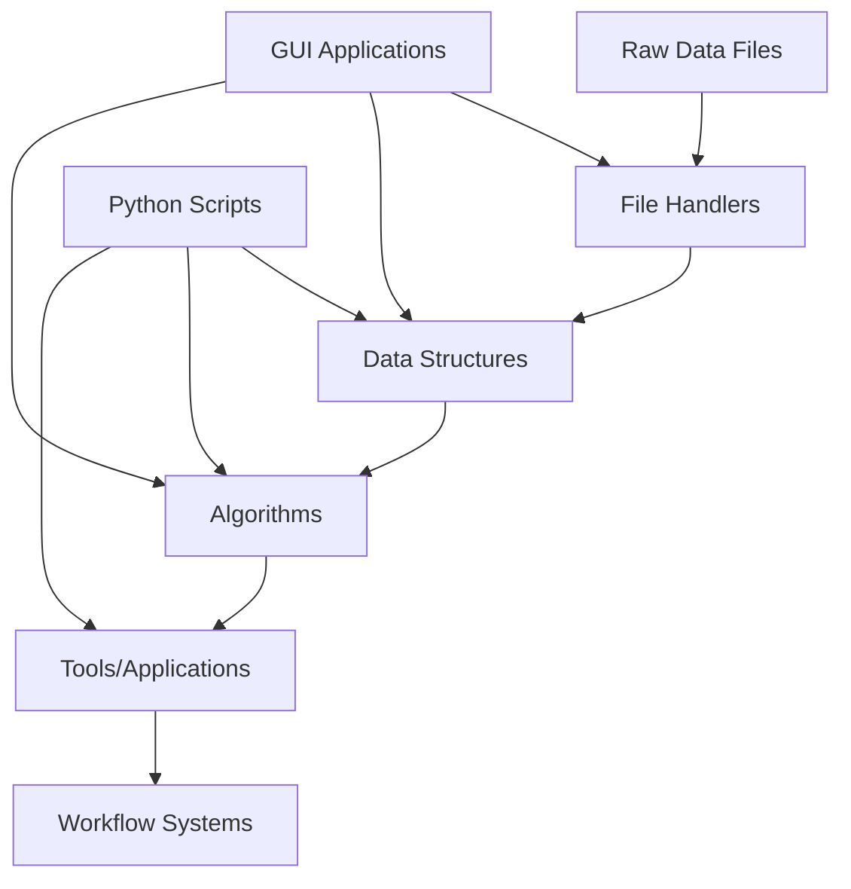

# OpenMS Architecture Documentation

## Introduction

OpenMS is an open‐source software framework dedicated to mass spectrometry data analysis in proteomics, metabolomics, and related fields. It provides a robust, flexible, and extensible platform that supports rapid algorithm development, data processing, and the creation of custom analysis pipelines. This document outlines the core architectural components, design principles, and future directions of the OpenMS project.

## Architecture Principles

- **Modularity & Extensibility:** Built as a collection of loosely coupled libraries and tools, OpenMS allows developers to easily integrate new algorithms and extend existing functionality.
- **Performance & Scalability:** Written in modern C++ and optimized for parallel processing, OpenMS is designed to handle large datasets efficiently.
- **Portability:** OpenMS runs natively on Windows, Linux, and macOS.
- **Robustness & Reliability:** Extensive error handling, automated unit and integration tests, and continuous integration (e.g., via CDASH) ensure high-quality, reproducible analyses.
- **User-Centric Design:** With a suite of command-line tools (TOPP), graphical interfaces (TOPPView, TOPPAS), and Python bindings (pyOpenMS), OpenMS caters to both developers and end users.

## Components

### 1. OpenMS Library
- **Kernel Classes**: Essential data structures for representing mass spectrometry data
  - `Peak1D`: Basic data structure for mass-to-charge ratio (m/z) and intensity pairs
  - `ChromatogramPeak`: Data structure for retention time and intensity pairs
  - `MSSpectrum`: Represents a single mass spectrum
  - `MSExperiment`: Container for multiple spectra and chromatograms
  - `Feature`: Represents a detected feature in a mass spectrum, characterized by properties like m/z, retention time, and intensity.
  - `FeatureMap`: Container for features detected in a sample
  - `ConsensusMap`: Container for features identified across multiple samples or conditions
  - `PeptideIdentification`: Container for peptide identification results
  - `ProteinIdentification`: Container for protein identification results
  - ...

- **Algorithms:**  
  Implements key algorithms for signal processing, feature detection, quantification, peptide identification, protein inference, alignment, and others.
  
- **File Handling & Format Support:**  
  - Robust support for standard MS file formats (mzML, mzXML, mgf, mzIdentML, TraML, ...).
  - Utilities for file conversion and handling compressed data are also provided.

### 2. TOPP Tools (The OpenMS Pipeline Tools)

TOPP consists of comprehensive suite of command-line tools built on top of the OpenMS library that can be easily integrated into workflow systems.

- **Tool Architecture**:
  - Common interface for all tools, ensuring consistency.
  - Standardized parameter handling system for configuring tool behavior.
  - Logging and error reporting mechanisms for debugging and monitoring.
  - Progress monitoring to provide feedback during long-running processes.
  - Input/output file handling to manage data flow between tools.

### 3. User Interfaces
- **Graphical Tools:**  
  - **TOPPView:** A dedicated viewer for raw spectra, chromatograms, and identification results.
  - Raw data visualization
  - Spectrum and chromatogram viewing
  - 2D/3D data representation 
  - Identification result visualization
  - Interactive data analysis

### 4. Scripting
- **Scripting & API: pyOpenMS**
  - Python bindings that expose core functionalities
  - Rapid prototyping of algorithms in Python
  - Integration with other scientific Python libraries (e.g., NumPy, SciPy)
  - Development of custom data processing workflows
  - Interactive data analysis and visualization in Jupyter notebooks

#### pyOpenMS Generation with Autowrap
  
The Python bindings for OpenMS are generated through a specialized process:

- **Autowrap Tool**: A custom Python tool developed specifically for generating OpenMS bindings
- **Declaration Process**:
  - Developers declare classes and functions to be exposed to Python in `.pxd` files located in the `pxds/` directory
  - These declarations specify the function signatures and class hierarchies
- **Code Generation Workflow**:
  1. Autowrap reads the declarations and automatically generates wrapping code
  2. Manual wrapper code can be added in the `addons/` folder for functionality that can't be wrapped automatically
  3. The output is a `pyopenms.pyx` file in the `pyopenms/` directory
  4. Cython translates this `.pyx` file to C++ code (`pyopenms.cpp`)
  5. A C++ compiler compiles this code into a Python module importable via `import pyopenms`
- **Customization Points**:
  - Special annotations like `wrap-ignore`, `wrap-as`, `wrap-iter-begin`, etc. can be used to customize the wrapping process
  - Allows for fine-grained control over how C++ classes and methods are exposed to Python
- **Complex C++ Features**: Autowrap handles many advanced C++ features automatically (with some caveats):
  - Operator overloading (e.g., implementing Python's `__add__`, `__getitem__`)
  - Complex template instantiations
  - Multiple inheritance scenarios
  - Static methods and variables


#### Manual Extensions with PYX Files

While autowrap handles most standard C++ to Python wrapping automatically, manual PYX files (in the `addons/` directory) enable advanced functionality that goes beyond simple wrapping:

- **Python-Specific Enhancements**:
  - Adding Pythonic interfaces to C++ classes
  - Custom exception handling and translation between C++ and Python exceptions
  - Implementing Python protocols (e.g., iteration, context managers)

- **Performance Optimizations**:
  - Custom memory management
  - Efficient data conversion between NumPy arrays and OpenMS data structures
  - Specialized handling for large datasets

- **Integration with Python Ecosystem**:
  - Converters to/from pandas DataFrames
  - Matplotlib visualization helpers
  - Integration with scientific Python libraries

- **Extension Methods**: Adding methods that exist only in Python and not in the C++ API, such as:
  - Convenience functions for common operations
  - Python-specific utility methods
  - Simplified interfaces for complex C++ functionality

## Data Flow and Processing Workflow

### Data Processing Pipeline

```mermaid
flowchart TD
    A[Raw Data] --> B[Open file format]
    B --> C[Analysis Pipeline (e.g., set of TOPP Tools, pyOpenMS Scripts)]
    C --> D[Export]
    D --> E[Visualization and Downstream Processing]
```

### Component Interactions

OpenMS components interact in a layered architecture:



- **Data Structures Layer**: Core data types like MSSpectrum, Feature, etc.
- **Algorithms Layer**: Processing algorithms implemented in C++
- **Tools Layer**: Command-line tools for specific tasks
- **Workflow Layer**: Pipeline systems for connecting multiple tools

## Extension Points and Customization

The OpenMS architecture is designed for extensibility at multiple levels:

### Algorithm Integration
- Well-defined interfaces enable the addition of new data processing and analysis algorithms
- Abstract base classes with consistent interfaces allow algorithm plugins
- Template-based design patterns for algorithm families (e.g., feature finders, peak pickers)

### File Format Support
- File handlers and extension hooks allow support for additional file formats
- Adapter pattern for integrating external libraries and parsers
- Extensible import/export framework with plugin architecture

### Tool Development
- Developers can build new TOPP tools by subclassing common base classes
- The `TOPPBase` class provides standardized parameter handling, logging, and I/O capabilities
- Integration with the standardized parameter and logging systems
- Tools can be built as standalone applications or library components

### Workflow Customization
- Users can combine OpenMS tools with custom scripts (e.g., via pyOpenMS)
- Support for workflow systems like KNIME and Galaxy
- Parameter files (INI format) for tool configuration and chaining
- TOPPAS workflow editor for visual pipeline construction

### Python Extensions
- Development of new algorithms in Python using pyOpenMS
- Integration with the Python scientific ecosystem
- Custom data processing pipelines in Python notebooks

## Build System

- **CMake Configuration:**
  OpenMS uses a CMake-based build system that ensures platform-independent compilation and simplifies dependency management.
  - Handles dependencies through a combination of system-provided libraries and vendored code
  - Configures build options for different platforms and compilers
  - Manages the generation of pyOpenMS bindings when the `-DPYOPENMS=ON` option is set
  - Uses vcpkg for consistent dependency management across platforms

- **Automated Testing & CI:**
  A comprehensive suite of unit tests, integration tests, and nightly builds (e.g., via CDASH) maintain code quality and facilitate rapid detection of issues.
  - Tests are built and run through CMake/CTest
  - Continuous integration workflows automate testing across different platforms
  - Test coverage reports help identify untested code regions

## Parallel Processing and Performance Optimization

### Parallelization Mechanisms
- **OpenMP Integration**: OpenMS uses OpenMP as the primary parallelization backend
  - Parallel algorithms for computationally intensive tasks
  - Configurable thread utilization based on available resources
  - Thread-safe data structures for parallel processing

### Performance Considerations
- **Memory Management**: Optimized data structures for handling large datasets
- **Algorithm Complexity**: Carefully designed algorithms to minimize computational complexity
- **I/O Optimization**: Efficient file handling for large mass spectrometry data files
- **Vectorization**: Use of SIMD instructions where applicable for compute-intensive operations

## Documentation Standards and Resources

### Code Documentation
- **API Documentation**: Doxygen-generated comprehensive API documentation
- **Inline Comments**: Structured in-code documentation following consistent standards
- **Coding Standards**: Style guidelines ensuring clarity and maintainability
- **Example Code**: Annotated examples demonstrating key functionality

### User Documentation
- **User Guides**: Comprehensive guides for different user levels (beginners to experts)
- **Tutorials**: Step-by-step tutorials for common tasks and workflows
- **Example Workflows**: Pre-configured workflows for typical analysis scenarios
- **FAQ and Troubleshooting**: Common issues and their solutions

### Developer Resources
- **Architecture Documentation**: High-level design documents (like this one)
- **Contribution Guidelines**: Clear guidelines for code contributions
- **Development Workflows**: Processes for feature development, bug fixing, and code review
- **Design Patterns**: Documentation of common patterns used throughout the codebase

## Testing Strategy

OpenMS employs a comprehensive testing strategy with tests organized in different directories based on their purpose:

### Class Tests
- Located in `src/tests/class_tests/openms/`
- Unit tests for OpenMS library components
- Tests individual classes and functions for correctness
- Follows a structured naming convention (e.g., `ClassNameTest.cpp` tests the `ClassName` class)

### GUI Tests
- Located in `src/tests/class_tests/openms_gui/`
- Tests specifically for graphical components
- Includes tests for visualization tools and user interfaces

### TOPP Tests
- Located in `src/tests/topp/`
- Tests for The OpenMS Pipeline Tools
- Integration tests that ensure command-line tools function correctly
- Tests include input files and expected output files for comparison

### Python Tests (pyOpenMS)
- Located in `src/pyOpenMS/tests/`
- Contains several types of tests:
  - `unittests/`: Tests for individual Python wrapped classes
  - `integration_tests/`: Tests combining multiple components
  - `memoryleaktests/`: Tests ensuring no memory leaks occur in Python bindings

### Continuous Integration
- Tests are run automatically via CI pipelines
- Ensures code quality across different platforms and environments
- Prevents regression bugs when new code is introduced

## Deployment and Distribution

OpenMS and its Python bindings (pyOpenMS) are distributed through several channels to suit different use cases and environments:

- **Standalone Installers:**  
  - For Windows and macOS, standalone installers (e.g., drag-and-drop installers for macOS) are provided for releases.

- **Bioconda:**  
  - OpenMS (and its library component `libopenms`) as well as its tools are available via the Bioconda channel.
  - The Python bindings, **pyOpenMS**, are available on Bioconda or pypi.

- **Container Images:**  
  - Docker and Singularity container images are provided through the OpenMS GitHub Container Registry as well as via BioContainers. These images bundle the OpenMS library, executables, and pyOpenMS so that users can deploy OpenMS in cloud or HPC environments with minimal setup.  


## Maintenance Guidelines

- **Code Reviews:**  
  All contributions undergo peer review to maintain quality and adherence to coding standards.
- **Release Management:**  
  Flexible release cycles with defined versioning protocols
- **Issue Tracking:**  
  Community-reported issues and feature requests are managed via GitHub issues


## Project Structure

The OpenMS codebase follows a structured organization:

```
OpenMS/
├── cmake/                   # CMake build system files and modules
├── contrib/                 # Third-party dependencies
├── doc/                     # Documentation files
├── share/                   # Shared resources
├── src/                     # Source code
│   ├── openms/              # Core OpenMS library
│   ├── openms_gui/          # GUI components
│   ├── openswathalgo/       # OpenSWATH algorithms
│   ├── pyOpenMS/            # Python bindings
│   │   ├── pxds/            # Class declarations for autowrap
│   │   ├── addons/          # Manual wrapping code
│   │   ├── pyopenms/        # Generated Python module
│   │   └── tests/           # Tests for Python bindings
│   ├── tests/               # C++ tests
│   │   ├── class_tests/     # Unit tests for classes
│   │   │   ├── openms/      # Tests for core library
│   │   │   └── openms_gui/  # Tests for GUI components
│   │   └── topp/            # Tests for TOPP tools
│   └── topp/                # TOPP tools implementation
└── tools/                   # Development tools and scripts
```

## Contributing

For detailed information about contributing to OpenMS, please refer to the CONTRIBUTING.md file in the repository.
